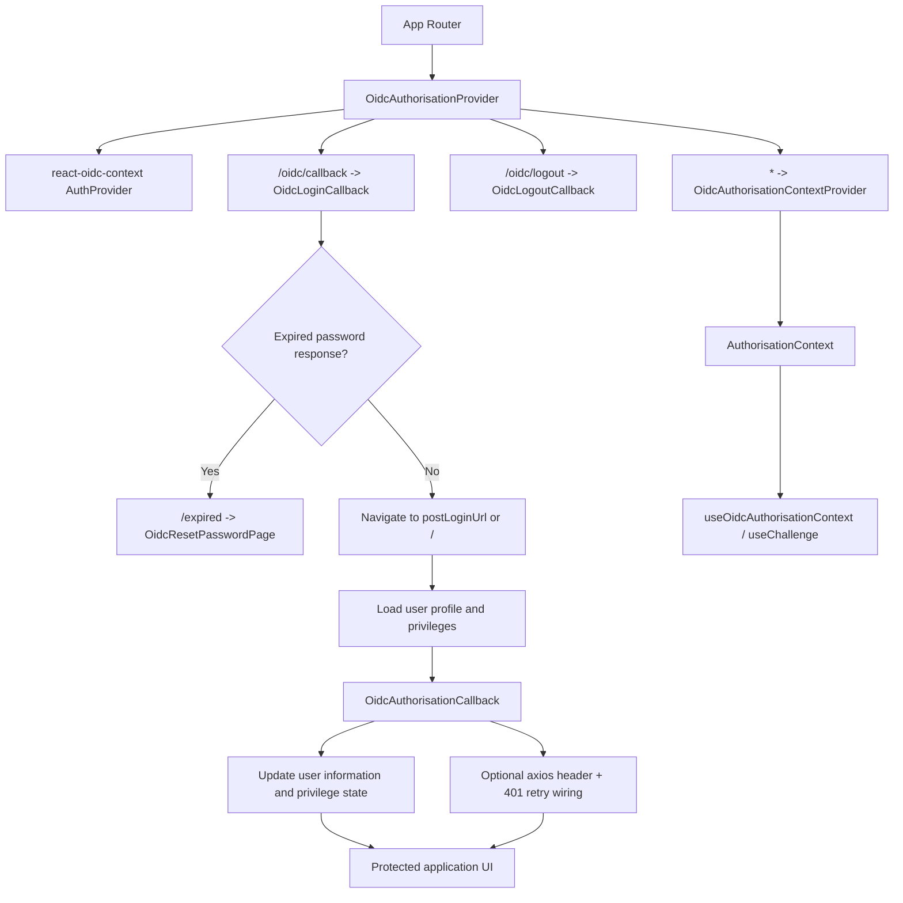

# @batoanng/oidc

[](https://www.npmjs.com/package/@batoanng/oidc)
[](https://packagephobia.com/result?p=@batoanng/oidc)

`@batoanng/oidc` wraps [`react-oidc-context`](https://github.com/authts/react-oidc-context) with router-aware callback routes, a shared authorisation context, post-login enrichment helpers, and ready-made authentication status screens for React single-page applications.

## Features

- Wraps `react-oidc-context` with login, logout, and expired-password routing.
- Exposes a shared authorisation context through `useOidcAuthorisationContext`, `useChallenge`, and `useChallengeResult`.
- Provides `OidcAuthorisationCallback` for post-login profile and privilege loading.
- Can wire an axios client with `Authorization` headers and a single silent-refresh retry on `401`.
- Ships reset-password, error, and status screens built on [`@batoanng/mui-components`](https://www.npmjs.com/package/@batoanng/mui-components).

## Installation

```bash
pnpm add @batoanng/oidc
```

Peer dependencies include `react`, `react-router-dom`, `react-oidc-context`, `axios`, MUI, and `@batoanng/mui-components`.

## Usage

Wrap the routed part of your app with `OidcAuthorisationProvider`. The provider must live inside a React Router `<Router>` because it injects callback routes with `<Routes>`.

```tsx
import { OidcAuthorisationProvider } from '@batoanng/oidc';

export function AppShell() {
  return (
    <OidcAuthorisationProvider
      userManagerSettings={{
        authority: 'https://your-idp.example.com',
        client_id: 'web-app',
        redirect_uri: 'http://localhost:3000/oidc/callback',
        post_logout_redirect_uri: 'http://localhost:3000/oidc/logout',
      }}
    >
      <AppRoutes />
    </OidcAuthorisationProvider>
  );
}
```

After the login callback completes, load the user profile and privileges, then hand them to `OidcAuthorisationCallback` so the shared authorisation context is populated before your protected UI renders.

```tsx
import axios from 'axios';
import {
  OidcAuthorisationCallback,
  useOidcAuthorisationContext,
  useEnsureOidcLoginToken,
} from '@batoanng/oidc';

const apiClient = axios.create({
  baseURL: '/api',
});

export function PostLoginGate() {
  const userInformation = {
    shortName: 'T. User',
    fullName: 'Test User',
    email: 'test@example.com',
  };

  const privileges = {
    'activityLog.read': true,
  };

  return (
    <OidcAuthorisationCallback apiClient={apiClient} userInformation={userInformation} privileges={privileges}>
      <ProtectedApp />
    </OidcAuthorisationCallback>
  );
}

export function ProtectedPage() {
  useEnsureOidcLoginToken();
  const { isAuthenticated, onLogout, token } = useOidcAuthorisationContext();

  return (
    <section>
      <div>{isAuthenticated ? 'Signed in' : 'Signed out'}</div>
      <div>{token}</div>
      <button onClick={() => void onLogout()}>Logout</button>
    </section>
  );
}
```

## Auth Flow



## Props

### `OidcAuthorisationProvider`

| Prop | Type | Notes |
| --- | --- | --- |
| `userManagerSettings` | `UserManagerSettings` | Passed through to `react-oidc-context`'s `AuthProvider`. |
| `loginCallbackRelativeUrl` | `string` | Optional override for the login callback route. Defaults to the pathname from `redirect_uri`, or `/oidc/callback`. |
| `logoutCallbackRelativeUrl` | `string` | Optional override for the logout callback route. Defaults to the pathname from `post_logout_redirect_uri`, or `/oidc/logout`. |
| `onLoggingIn` | `(options?: LoginOptions) => void \| boolean \| Promise<void \| boolean>` | Return `false` to cancel a login attempt. |
| `onLoggingOut` | `() => void \| boolean \| Promise<void \| boolean>` | Return `false` to cancel a logout attempt. |
| `onPasswordReset` | `(email: string) => void \| boolean \| Promise<void \| boolean>` | Called when the expired-password flow submits or resends a reset email. |

### `OidcAuthorisationCallback`

| Prop | Type | Notes |
| --- | --- | --- |
| `apiClient` | `AxiosInstance` | Optional axios instance that receives `Authorization` header updates and a single silent-refresh retry on `401`. |
| `userInformation` | `UserInformation \| string` | Provide the loaded user profile, or a redirect URL string to navigate away after login. |
| `privileges` | `UserPrivileges` | The resolved privilege map for the current user. |
| `error` | `Error \| null` | Renders the built-in login error state and lets the user log out. |
| `authScheme` | `string` | Authorization scheme used when populating the `Authorization` header. Defaults to `Bearer`. |

## Integration Notes

### Default routes

| Route | Purpose |
| --- | --- |
| `/oidc/callback` | Handles the OIDC login redirect. |
| `/oidc/logout` | Handles the OIDC logout redirect. |
| `/expired` | Shows the password reset flow when the IdP reports an expired-password response. |

### Axios behavior

- `setBearerToken` stores the current access token on the axios instance and keeps `defaults.headers.common.Authorization` in sync.
- `OidcAuthorisationCallback` installs one response interceptor for the provided `apiClient`.
- A `401` triggers one `signinSilent()` attempt. If a new token is returned, the failed request is retried once with a refreshed `Authorization` header.

### Related packages

- [`@batoanng/mui-components`](https://www.npmjs.com/package/@batoanng/mui-components) supplies the status, notification, and form primitives used by the built-in screens.
- [`@batoanng/utils`](https://www.npmjs.com/package/@batoanng/utils) is a related workspace utility package, but `@batoanng/oidc` now uses `react-use` directly for its local hook helpers.

## Development

```bash
pnpm --dir packages/oidc lint
pnpm --dir packages/oidc type-check
pnpm --dir packages/oidc test
pnpm --dir packages/oidc build
```

Key files:

- `src/OidcAuthorisationProvider.tsx`
- `src/OidcAuthorisationContextProvider.tsx`
- `src/OidcAuthorisationCallback.tsx`
- `src/hooks.ts`
- `src/types.ts`
